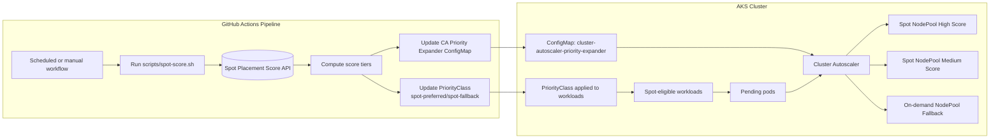
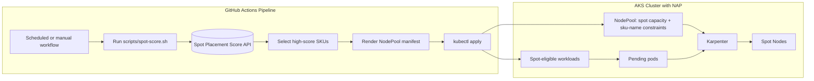

# Intelligent Spot VM Scaling on Azure Kubernetes Service (AKS)

[](https://opensource.org/licenses/MIT)
[](https://github.com/iamvighnesh/intelligent-spot-scaling-on-aks/issues)

> **Optimize AKS cluster costs by intelligently selecting spot VM sizes based on real-time availability data from the Azure Spot Placement Score API**

This repository demonstrates two approaches to leverage the [Spot Placement Score API](https://learn.microsoft.com/en-us/azure/virtual-machine-scale-sets/spot-placement-score) for intelligent spot VM selection on AKS:

| Approach                                                             | Description                                        | Best For                                         |
|----------------------------------------------------------------------|----------------------------------------------------|--------------------------------------------------|
| **[Cluster Autoscaler](#cluster-autoscaler-approach)**               | Priority expander with pre-created spot node pools | Existing AKS clusters with defined node pools    |
| **[Node Auto Provisioning (NAP)](#node-auto-provisioning-approach)** | Karpenter-based dynamic node provisioning          | New clusters wanting simplified, dynamic scaling |

## Table of Contents

- [Overview](#overview)
- [Prerequisites](#prerequisites)
- [Cluster Autoscaler Approach](#cluster-autoscaler-approach)
- [Node Auto Provisioning Approach](#node-auto-provisioning-approach)
- [Spot Placement Score API](#spot-placement-score-api)
- [Monitoring](#monitoring)
- [Contributing](#contributing)
- [License](#license)

## Overview

The **Azure Spot Placement Score API** returns availability scores (`High`, `Medium`, `Low`) for VM sizes in specific regions. This repository uses these scores to:

- **Cluster Autoscaler**: Configure priority expander to prefer node pools with high spot availability
- **Node Auto Provisioning**: Generate Karpenter NodePool manifests with optimal spot VM SKUs

## Prerequisites

- Azure CLI (`az`) with active subscription
- `jq` for JSON processing
- `kubectl` and `kubelogin` for Kubernetes operations
- Terraform for infrastructure deployment

## Cluster Autoscaler Approach

Uses the [priority expander](https://github.com/kubernetes/autoscaler/blob/master/cluster-autoscaler/expander/priority/readme.md) to scale node pools based on spot availability scores.

### Architecture



```
┌─────────────────────────────────────────────────────────┐
│                    AKS Cluster                          │
├─────────────────────────────────────────────────────────┤
│  Priority 30: High-score spot pools (preferred)         │
│  Priority 20: Medium-score spot pools                   │
│  Priority 10: On-demand pool (fallback)                 │
└─────────────────────────────────────────────────────────┘
```

### Quick Start

```bash
cd cluster-autoscaler

# 1. Configure and deploy infrastructure
cp dev.tfvars.example dev.tfvars  # Edit with your values
terraform init && terraform apply -var-file=dev.tfvars

# 2. Run spot score assessment and apply ConfigMap
./deploy.sh

# Or preview without applying
./deploy.sh --dry-run
```

### How It Works

1. **Terraform** creates AKS cluster with on-demand and spot node pools
2. **deploy.sh** queries Spot Placement Score API
3. Generates `cluster-autoscaler-priority-expander` ConfigMap with dynamic priorities
4. Cluster Autoscaler scales highest-priority pools first

### Generated ConfigMap Example

```yaml
apiVersion: v1
kind: ConfigMap
metadata:
  name: cluster-autoscaler-priority-expander
  namespace: kube-system
data:
  priorities: |-
    10:
    - .*default.*
    20:
    - .*d4dsv4*
    30:
    - .*d4dsv5*
    - .*d8dsv5*
```

### Deploy Workloads

```bash
kubectl apply -f demo-deployment.yaml
kubectl scale deployment scaling-demo --replicas=20
```

---

## Node Auto Provisioning Approach

Uses [Karpenter](https://karpenter.sh/) (via AKS Node Auto Provisioning) to dynamically provision spot nodes with optimal SKUs.

### Architecture



### Quick Start

```bash
cd node-auto-provisioning

# 1. Configure and deploy infrastructure
cp dev.tfvars.example dev.tfvars  # Edit with your values
terraform init && terraform apply -var-file=dev.tfvars

# 2. Run spot score assessment and apply NodePool
./deploy.sh

# Or preview without applying
./deploy.sh --dry-run
```

### How It Works

1. **Terraform** creates AKS cluster with Node Auto Provisioning enabled
2. **deploy.sh** queries Spot Placement Score API
3. Generates Karpenter `NodePool` manifest with high-score SKUs
4. Karpenter provisions spot nodes using optimal VM sizes

### Generated NodePool Example

```yaml
apiVersion: karpenter.sh/v1
kind: NodePool
metadata:
  name: default
spec:
  template:
    spec:
      requirements:
      - key: karpenter.sh/capacity-type
        operator: In
        values:
        - spot
      - key: karpenter.azure.com/sku-name
        operator: In
        values:
        - Standard_D4as_v5
        - Standard_D8as_v5
```

### Deploy Workloads

```bash
kubectl apply -f demo-deployment.yaml
kubectl scale deployment scaling-demo --replicas=20
```

**Note:** Workloads must use Karpenter labels for node selection:

```yaml
nodeSelector:
  karpenter.sh/capacity-type: spot
tolerations:
- key: karpenter.sh/capacity-type
  operator: Equal
  value: spot
  effect: NoSchedule
```

---

## Spot Placement Score API

Both approaches use the same API to get spot availability scores:

```bash
az compute-recommender spot-placement-score \
    --location westus3 \
    --subscription "$SUBSCRIPTION_ID" \
    --availability-zones true \
    --desired-locations '["westus3"]' \
    --desired-count 10 \
    --desired-sizes '[{"sku":"Standard_D4as_v5"},{"sku":"Standard_D8as_v5"}]'
```

### Score Levels

| Score      | Meaning                | Action                                    |
|------------|------------------------|-------------------------------------------|
| **High**   | Best spot availability | Highest priority / included in NodePool   |
| **Medium** | Moderate availability  | Medium priority (Cluster Autoscaler only) |
| **Low**    | Limited availability   | Not recommended for spot                  |

### Configuration

Set these environment variables before running the deployment scripts:

| Variable                    | Description              | Default                                                 |
|-----------------------------|--------------------------|---------------------------------------------------------|
| `AZURE_SUBSCRIPTION_ID`     | Azure subscription       | Current subscription                                    |
| `AZURE_RESOURCE_GROUP_NAME` | Resource group           | `aks-sps-with-cas-rg` / `aks-sps-with-nap-rg`           |
| `AZURE_AKS_CLUSTER_NAME`    | AKS cluster name         | `aks-sps-with-cas-cluster` / `aks-sps-with-nap-cluster` |
| `PREFERRED_REGIONS`         | Target regions (JSON)    | `["westus3"]`                                           |
| `PREFERRED_VM_SIZES`        | VM SKUs to assess (JSON) | See scripts                                             |
| `DESIRED_VM_COUNT`          | VM count for scoring     | `10`                                                    |

### CLI Options

Both deployment scripts support these options:

```bash
./deploy.sh --help       # Show usage
./deploy.sh --dry-run    # Preview without applying
./deploy.sh --verbose    # Detailed output
```

---

## Monitoring

### Cluster Autoscaler Logs

```bash
kubectl logs -n kube-system -l app=cluster-autoscaler --tail=50 -f
```

### Karpenter Logs (NAP)

```bash
kubectl logs -n kube-system -l app.kubernetes.io/name=karpenter --tail=50 -f
```

### Node Status

```bash
kubectl get nodes -o wide
```

---

## Cleanup

```bash
# For Cluster Autoscaler approach
cd cluster-autoscaler && terraform destroy -var-file=dev.tfvars

# For Node Auto Provisioning approach
cd node-auto-provisioning && terraform destroy -var-file=dev.tfvars
```

## Contributing

We welcome contributions!

- 🐛 [Report bugs](https://github.com/iamvighnesh/intelligent-spot-scaling-on-aks/issues)
- 💡 [Suggest features](https://github.com/iamvighnesh/intelligent-spot-scaling-on-aks/discussions)
- ⭐ Star if useful!

## License

MIT License - see [LICENSE](LICENSE) for details.

## Acknowledgments

- [Kubernetes Cluster Autoscaler](https://github.com/kubernetes/autoscaler/tree/master/cluster-autoscaler)
- [Karpenter](https://karpenter.sh/)
- [Azure Spot Placement Score API](https://learn.microsoft.com/en-us/azure/virtual-machine-scale-sets/spot-placement-score)

---

